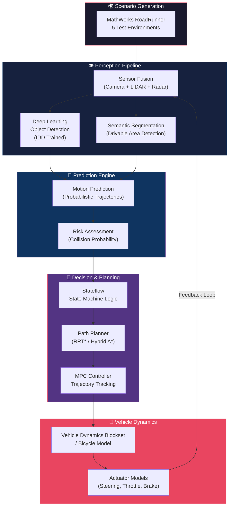

# 🚗 Implementation Plan — SIH 2026

## Adaptive Path Planning & Collision Avoidance for Autonomous Vehicles on Unstructured Indian Roads

| Field | Details |
|---|---|
| **Problem Statement ID** | SIH26037 |
| **Theme** | Smart Vehicles |
| **Category** | Software |
| **Team Name** | IQ Holders |

---

## 1. Problem Statement

Design and implement an **adaptive path planning and collision avoidance system** for autonomous vehicles operating on **unstructured Indian roads** — roads that lack clear lane markings, have mixed-mode traffic (auto-rickshaws, pushcarts, cattle, pedestrians), and feature unpredictable scenarios like informal highway merging, dense markets, and unmarked village roads.

### Core Concept

A **dynamic, closed-loop simulation pipeline** that abandons strict lane-based assumptions in favor of **probabilistic, real-time trajectory mapping**. The system specifically predicts the irregular, short-term motion of uniquely Indian road agents and instantly recalculates safe paths when faced with sudden obstacles or missing lane markings.

---

## 2. Tech Stack

### 2.1 Simulation & Environment Design

| Tool | Purpose | Version |
|---|---|---|
| **MathWorks RoadRunner** | 3D road network & scenario design for 5 critical Indian test environments | Latest (R2025b+) |
| **MATLAB** | Core scripting, algorithm development, data analysis | R2025b or later |
| **Simulink** | Model-based design, system integration, closed-loop simulation | R2025b or later |

### 2.2 Perception & AI

| Tool | Purpose |
|---|---|
| **Automated Driving Toolbox** | Sensor fusion (camera + LiDAR + radar), ground-truth labeling, scenario simulation |
| **Deep Learning Toolbox** | Training & deploying CNNs/transformers for object detection and semantic segmentation |
| **Computer Vision Toolbox** | Image processing, feature extraction, optical flow |
| **Indian Driving Dataset (IDD)** | Training data — 10,000+ frames from Indian roads with pixel-level annotations |

### 2.3 Decision, Planning & Control

| Tool | Purpose |
|---|---|
| **Navigation Toolbox** | Collision-free path generation (RRT*, Hybrid A*, PRM algorithms) |
| **Stateflow** | Finite state-machine logic for event-driven decision making |
| **Model Predictive Control (MPC) Toolbox** | Trajectory tracking and optimal control for path following |
| **Robotics System Toolbox** | Coordinate transforms, motion planning utilities |

### 2.4 Vehicle Dynamics & Validation

| Tool | Purpose |
|---|---|
| **Vehicle Dynamics Blockset** | High-fidelity vehicle physics (tire models, suspension, powertrain) |
| **Simulink Bicycle Model** | Lightweight alternative for rapid prototyping of lateral/longitudinal dynamics |
| **Simulink Test** | Automated test harnesses, regression testing, coverage analysis |

### 2.5 Supporting Infrastructure

| Tool | Purpose |
|---|---|
| **MATLAB Parallel Computing Toolbox** | GPU acceleration for deep learning training |
| **MATLAB Coder / GPU Coder** | Auto-generate optimized C/CUDA code for deployment |
| **Git + GitHub** | Version control and team collaboration |
| **MATLAB Report Generator** | Auto-generate test reports and documentation |

---

## 3. System Architecture



---

## 4. Five Critical Test Environments

| # | Scenario | Key Challenges | Priority |
|---|---|---|---|
| 1 | **Unmarked Village Road** | No lane markings, narrow width, pedestrians, cattle, unpredictable two-way traffic | 🔴 Critical |
| 2 | **Dense Market Area** | Extremely slow mixed traffic, pushcarts, hawkers, sudden stops, no sidewalks | 🔴 Critical |
| 3 | **Urban Intersection (No Signals)** | Multi-directional traffic, auto-rickshaws cutting, informal right-of-way | 🔴 Critical |
| 4 | **Highway Merging Zone** | High-speed informal merging, trucks, overloaded vehicles, no merge lanes | 🟡 High |
| 5 | **School/Hospital Zone** | Speed bumps, pedestrian crossings, parked vehicles reducing road width | 🟡 High |

---

## 5. Phased Development Timeline

### Phase 1: Foundation (Weeks 1–2)
- [ ] Set up MATLAB/Simulink environment with all required toolboxes
- [ ] Download and preprocess the **Indian Driving Dataset (IDD)**
- [ ] Design **Scenario 1 (Village Road)** and **Scenario 2 (Dense Market)** in RoadRunner
- [ ] Build basic sensor simulation (camera + LiDAR placement on ego vehicle)
- [ ] Establish Git repository and project structure

### Phase 2: Perception Pipeline (Weeks 3–4)
- [ ] Train **YOLOv4/YOLOv5** object detection model on IDD dataset using Deep Learning Toolbox
- [ ] Implement **semantic segmentation** model for drivable area detection (no lane markings)
- [ ] Build **sensor fusion** pipeline combining camera, LiDAR, and radar detections
- [ ] Validate perception accuracy on Scenario 1 and 2 environments
- [ ] Achieve ≥ 85% mAP on Indian traffic agent detection

### Phase 3: Prediction & Planning (Weeks 5–6)
- [ ] Implement **probabilistic motion prediction** for erratic agents (auto-rickshaws, pedestrians)
- [ ] Build **Stateflow** state machine for decision logic:
  - Normal driving → Obstacle detected → Emergency braking / Lane change
  - Cattle crossing → Full stop → Slow resume
  - Informal merge → Yield / Assertive merge
- [ ] Integrate **RRT*** path planner from Navigation Toolbox
- [ ] Implement **MPC controller** for smooth trajectory tracking
- [ ] Design remaining **3 scenarios** in RoadRunner

### Phase 4: Vehicle Dynamics & Integration (Weeks 7–8)
- [ ] Configure **Vehicle Dynamics Blockset** (or Simulink bicycle model)
- [ ] Integrate full closed-loop pipeline: Perception → Prediction → Planning → Control → Dynamics
- [ ] Implement **replanning** mechanism with < 200ms latency target
- [ ] Run closed-loop simulations across all 5 scenarios
- [ ] Optimize deep learning inference speed for real-time performance

### Phase 5: Testing, Optimization & Documentation (Weeks 9–10)
- [ ] Run automated **regression tests** using Simulink Test
- [ ] Profile and optimize replanning latency
- [ ] Generate **performance metrics dashboard** (collision rate, replanning latency, path smoothness)
- [ ] Prepare final demo with all 5 scenarios
- [ ] Complete documentation and presentation materials

---

## 6. Key Performance Metrics (KPIs)

| Metric | Target | Measurement Method |
|---|---|---|
| **Collision Rate** | 0% in all 5 scenarios | Closed-loop simulation count |
| **Replanning Latency** | < 200 ms | Timer profiling in Simulink |
| **Object Detection mAP** | ≥ 85% | IDD validation set |
| **Drivable Area IoU** | ≥ 80% | Semantic segmentation evaluation |
| **Path Smoothness** | Jerk < 2 m/s³ | Vehicle dynamics telemetry |
| **Scenario Pass Rate** | 100% (5/5) | Automated test suite |

---

## 7. Risk Mitigation

| Risk | Impact | Mitigation Strategy |
|---|---|---|
| High replanning latency in dense traffic | Vehicle cannot react in time | Optimize DL models for inference speed; use simplified bounding-box predictions for peripheral agents |
| IDD dataset insufficient for all agent types | Poor detection of pushcarts/cattle | Augment with synthetic data generated in RoadRunner scenarios |
| Stateflow complexity explosion | Difficult to debug and maintain | Modular hierarchical state charts; unit test each sub-state |
| Simulink simulation speed too slow | Cannot run real-time closed-loop | Use Simulink rapid accelerator mode; consider C code generation |

---

## 8. Team Responsibilities

| Role | Responsibility |
|---|---|
| **Scenario Designer** | RoadRunner environment design, scenario scripting |
| **Perception Engineer** | Sensor fusion, DL model training, IDD preprocessing |
| **Planning Engineer** | Path planning algorithms, Stateflow logic, MPC tuning |
| **Dynamics Engineer** | Vehicle model configuration, actuator modeling |
| **Integration & Test Lead** | End-to-end pipeline integration, test automation, metrics |
| **Documentation Lead** | Reports, presentation, demo preparation |

---

## 9. Research References

1. **Varma et al.** — *"IDD: A Dataset for Exploring Problems of Autonomous Navigation in Unconstrained Environments"* (WACV) — Primary dataset citation
2. **MDPI** — *"Explainable AI in Scene Understanding for Autonomous Vehicles in Unstructured Indian Roads"* — DL architectures for semantic segmentation on Indian roads
3. **Journal of Field Robotics, 2026** — *"Autonomous Ground Robot in Unstructured Environments: How Far Have We Come?"* — Survey of 250+ papers on perception, planning, and end-to-end driving

---

## 10. Verification Plan

### Automated Tests
```bash
# Run full regression test suite across all 5 scenarios
matlab -batch "run('tests/run_all_scenario_tests.m')"

# Evaluate perception model accuracy
matlab -batch "run('tests/evaluate_perception_model.m')"

# Profile replanning latency
matlab -batch "run('tests/profile_replanning_latency.m')"
```

### Manual Verification
- Visual inspection of planned trajectories overlaid on RoadRunner scenarios
- Demo walkthrough of each scenario with live Simulink simulation
- Review of collision logs and near-miss analysis
- Jury/mentor evaluation during SIH hackathon presentation

---

> [!IMPORTANT]
> This is a **software-only** solution. The entire perception-to-planning pipeline is built and validated within the **MATLAB/Simulink ecosystem**. No physical hardware or vehicle is required.
